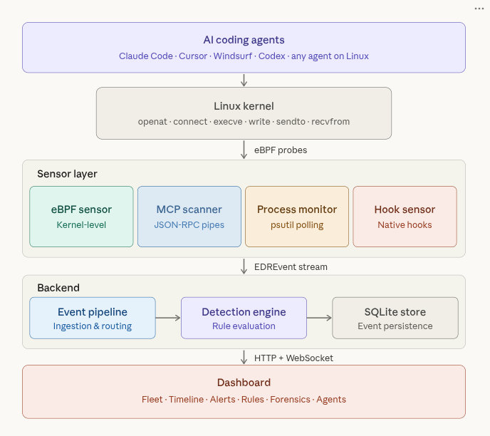

# Claude EDR - Endpoint Detection & Response for AI Coding Agents



**Non-invasive, kernel-level security monitoring for every AI coding agent on your machine.**

Claude EDR uses eBPF to observe AI agent behavior directly from the Linux kernel - no plugins, no agent modifications, no vendor lock-in. It sees every file read, network connection, process spawn, and MCP tool call made by any AI assistant, regardless of which tool you use.

## Why eBPF?

Traditional security tools require cooperation from the software they monitor - hooks, plugins, or API integrations that break when agents update and only work with specific vendors. Claude EDR takes a fundamentally different approach:

**eBPF attaches to kernel syscalls.** Every AI agent - whether it's Claude Code, Cursor, Windsurf, or a tool that doesn't exist yet - must go through the kernel to touch files, open network sockets, or spawn processes. Claude EDR intercepts at that layer, making it:

- **Agent-agnostic** - Works with any AI tool, current or future. If it runs on Linux, we see it.
- **Non-invasive** - Zero modifications to your AI agents. No hooks to install, no configs to change, no performance overhead on the agent itself.
- **Tamper-resistant** - A compromised MCP server can't disable monitoring because it runs in kernel space, not user space.
- **Complete** - Captures activity that agents don't self-report: background network connections, child process spawns, file access outside the declared working directory.

The eBPF verifier guarantees safety - probes cannot crash the kernel, corrupt memory, or cause system instability.

## What It Detects

| Threat | Example | How We See It |
|--------|---------|---------------|
| **Credential Theft** | MCP server reads `~/.ssh/id_rsa` or `~/.aws/credentials` | eBPF `openat` syscall tracing |
| **Data Exfiltration** | Tool sends code to unknown external endpoint | eBPF `connect` + `sendto` syscall tracing |
| **Reverse Shell** | Agent spawns `bash -i >& /dev/tcp/...` | eBPF `execve` + process tree analysis |
| **Supply Chain Attack** | Malicious MCP server runs arbitrary commands | MCP JSON-RPC pipe interception |
| **Prompt Injection** | Agent behavior shifts mid-session | Session anomaly detection + tool call patterns |
| **Destructive Operations** | `rm -rf /`, `git push --force`, `DROP TABLE` | eBPF file/process monitoring + rule matching |

## Sensor Stack

Claude EDR layers multiple sensors for defense in depth:

| Sensor | Root | Scope | How It Works |
|--------|:----:|-------|--------------|
| **eBPF** | Yes | All agents | Kernel probes on `openat`, `connect`, `execve`, `write`, `sendto`, `recvfrom`. Sees everything. |
| **MCP Scanner** | No | MCP-capable agents | Discovers MCP servers from agent configs, intercepts JSON-RPC traffic on stdio pipes |
| **Process Monitor** | No | All agents | `psutil`-based polling of process trees, command lines, file descriptors |
| **Hook Sensor** | No | Claude Code | Unix socket receiver for Claude Code's native hook system (PreToolUse/PostToolUse) |

eBPF provides the ground truth. The other sensors add context and work as fallbacks when running without root.

## Quick Start

### Local (Python 3.12+)

```bash
# Install
uv sync

# Start the daemon + dashboard
uv run claude-edr start

# Dashboard at http://127.0.0.1:7400
```

For full eBPF visibility, run with root:
```bash
sudo uv run claude-edr start
```

### Docker

```bash
docker compose up -d

# Dashboard at http://localhost:7400
```

## Dashboard

Real-time web UI (Jinja2 + HTMX + WebSocket):

- **Fleet View** - All monitored endpoints at a glance
- **Agent Inventory** - Every AI agent discovered on the system with full MCP/hook/skill enumeration
- **Timeline** - Searchable event stream across all sensors
- **Alerts** - Detection rule hits organized by severity
- **Rules** - Create, edit, toggle, and test YAML detection rules from the browser
- **Forensics** - Deep-dive investigation of incidents
- **Detail Drilldowns** - Per-agent, per-session, per-MCP, per-hook analysis

## Detection Rules

1450+ lines of YAML rules across 8 categories:

```
rules/
├── default.yaml              # Baseline rules
├── 01-tool-calls.yaml        # MCP tool abuse, credential access
├── 02-llm-traffic.yaml       # LLM API patterns, data exfil
├── 03-process-activity.yaml  # Shell exec, privesc, reverse shells
├── 04-file-activity.yaml     # SSH keys, AWS creds, destructive ops
├── 05-network-activity.yaml  # C2 communication, data exfil
├── 06-mcp-activity.yaml      # Malicious MCP server patterns
└── 07-session-anomalies.yaml # Behavioral anomalies
```

Custom rules can be created via the dashboard UI and persist to `rules/custom.yaml`.

## Supported Agents

Because eBPF operates at the kernel level, Claude EDR monitors **any process** on the system. Agent-specific discovery provides richer context:

| Agent | Auto-Discovery | MCP Config Parsing | Process Tree Tracking |
|-------|:--------------:|:------------------:|:---------------------:|
| Claude Code | Yes | Yes | Yes |
| Cursor | Yes | Yes | Yes |
| Windsurf | Yes | Yes | Yes |
| OpenAI Codex CLI | Yes | Yes | Yes |
| GitHub Copilot CLI | Yes | Yes | Yes |
| Gemini CLI | Yes | Yes | Yes |
| Aider | Yes | - | Yes |
| Goose (Block) | Yes | Yes | Yes |
| Amp (Sourcegraph) | Yes | Yes | Yes |
| Zed | Yes | Yes | Yes |
| Any future agent | Via eBPF | - | Yes |

## Architecture

```
┌──────────────────────────────────────────────────────┐
│            AI Coding Agents (any tool)               │
│     Claude Code · Cursor · Windsurf · Codex · ...    │
└───────────────────────┬──────────────────────────────┘
                        │
            ┌───────────┼───────────┐
            │     Linux Kernel      │
            │  openat · connect     │
            │  execve · write       │
            │  sendto · recvfrom    │
            └───────────┬───────────┘
                        │ eBPF probes
┌───────────────────────▼──────────────────────────────┐
│                  Sensor Layer                         │
│  eBPF Sensor · MCP Scanner · Process Mon · Hooks     │
└───────────────────────┬──────────────────────────────┘
                        │ EDREvent stream
┌───────────────────────▼──────────────────────────────┐
│                    Backend                            │
│  Event Pipeline → Detection Engine → SQLite Store    │
│  Agent Registry · Rule Evaluation · Alert Generation │
└───────────────────────┬──────────────────────────────┘
                        │ HTTP + WebSocket
┌───────────────────────▼──────────────────────────────┐
│                   Dashboard                           │
│  Fleet · Agents · Timeline · Alerts · Rules          │
│  Forensics · Sessions · MCP Detail                   │
└──────────────────────────────────────────────────────┘
```

## Configuration

Default config: `config/claude-edr.toml`
User override: `~/.config/claude-edr/config.toml`

Environment variables:

```bash
CLAUDE_EDR_DASHBOARD_HOST=0.0.0.0        # Bind address (default: 127.0.0.1)
CLAUDE_EDR_DASHBOARD_PORT=7400            # Dashboard port
CLAUDE_EDR_DB_PATH=/data/events.db        # SQLite database path
CLAUDE_EDR_SOCKET=/run/claude-edr/edr.sock  # Hook sensor socket
```

## Project Structure

```
claude-edr/
├── src/claude_edr/
│   ├── backend/           # FastAPI server, detection engine, SQLite store, event pipeline
│   ├── sensor/            # eBPF probes, process monitor, hook receiver, MCP scanner
│   └── dashboard/         # Jinja2 templates, HTMX UI, static assets
├── rules/                 # YAML detection rules (1450+ lines)
├── config/                # Default TOML configuration
├── scripts/               # Test event injection utilities
├── tests/                 # Malicious MCP server for rule validation
├── Dockerfile
├── docker-compose.yml
└── pyproject.toml
```

## License

MIT
